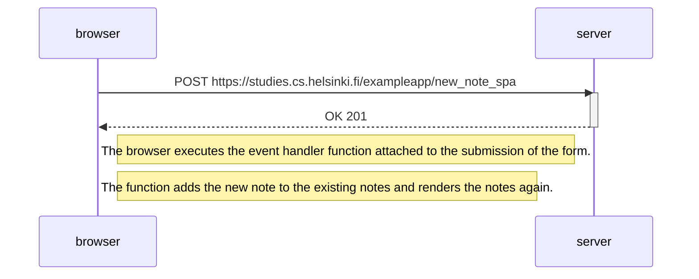

Sequence diagram for when user submits the form in https://studies.cs.helsinki.fi/exampleapp/spa

```mermaid
sequenceDiagram
    participant browser
    participant server
    
    browser->>server: POST https://studies.cs.helsinki.fi/exampleapp/new_note_spa
    activate server
    server-->>browser: OK 201
    deactivate server

    Note right of browser: The browser executes the event handler function attached to the submission of the form.

    Note right of browser: The function adds the new note to the existing notes and renders the notes again.
```